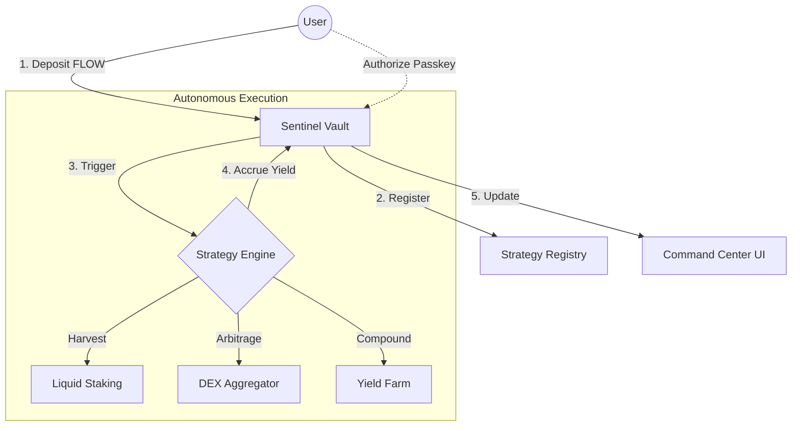

# 🛡️ Flow Sentinel
### *The Autonomous DeFi Command Center*


**Flow Sentinel** is a next-generation autonomous wealth manager built on the Flow Blockchain. It abstracts the complexities of DeFi yield optimization into secure, self-executing "Sentinels" that protect your capital while maximizing growth.

---

## 🚩 The Problem
DeFi today is fragmented, complex, and prone to "Invisible Taxes":
*   **Manual Fatigue**: Users must manually claim, restake, and harvest yields across multiple protocols.
*   **MEV Predators**: Front-running and sandwich attacks drain value from every large transaction.
*   **UX Friction**: High learning curves and clunky wallet interactions prevent institutional adoption.
*   **Static Assets**: Capital often sits idle in simple wallets instead of participating in the broader DeFi ecosystem.

## � The Solution: Flow Sentinel
We transform "Static Liquidity" into "Autonomous Capital" using Flow's unique architecture:
*   **Hyper-Automation (Forte)**: Vaults that execute their own rebalancing logic on-chain.
*   **MEV-Resistant Design**: Native randomness integration to prevent predictable bot attacks.
*   **Biometric Command**: FaceID/Passkey authorization for high-security vault operations.
*   **Aggregated Yield**: A single dashboard to manage Liquid Staking, DEX Arbitrage, and Yield Farming.

## � Why We Are Unique
1.  **Flow-Native Intelligence**: Leveraging Flow's *Account Linking* and *Native Randomness* for superior security.
2.  **Zero-Click Maintenance**: Once deployed, your Sentinel handles the protocol interactions.
3.  **Institutional UX**: A "Bloomberg Terminal" aesthetic for the everyday DeFi user.
4.  **Verifiable Growth**: Every yield harvest is a transparent on-chain event, linkable to the explorer.

---

## 🔄 System Workflow



---

## 🛠️ Technical Stack

| Layer | Technology |
| :--- | :--- |
| **Blockchain** | Flow (Cadence Smart Contracts) |
| **Frontend** | Next.js 15 (App Router), React 19 |
| **Styling** | Tailwind CSS (Frictionless Glassmorphism) |
| **Animations** | Framer Motion (60FPS Interactive UI) |
| **Connectivity** | FCL (Flow Client Library), RainbowKit |
| **Deployment** | Netlify (Edge Functions & SSR) |

---

## 🚀 Quick Launch Guide

### 1. Locally
```bash
git clone https://github.com/Aaditya1273/Flow-Sentinel.git
npm install
cp .env.example .env.local
npm run dev
```

### 2. Live Environment Variables
Connect to Testnet by setting these in your `.env` or Netlify Dashboard:
```env
NEXT_PUBLIC_FLOW_NETWORK=testnet
NEXT_PUBLIC_FLOW_ACCESS_NODE=https://rest-testnet.onflow.org
NEXT_PUBLIC_SENTINEL_VAULT_ADDRESS=0x136b642d0aa31ca9
NEXT_PUBLIC_STRATEGY_REGISTRY_ADDRESS=0x136b642d0aa31ca9
NEXT_PUBLIC_WALLET_CONNECT_PROJECT_ID=3a8170812b534d0ff9d794f19a901d64
```

---

## 🗺️ Roadmap
- [x] **Phase 1**: Core Vault Logic & Testnet Deployment.
- [x] **Phase 2**: Professional Analytics Dashboard.
- [ ] **Phase 3**: Multi-sig Governance for Community Vaults.
- [ ] **Phase 4**: Mainnet Launch & Institutional API.

---

**Built for the future of finance on the Flow Blockchain.**
*Flow Sentinel - Where DeFi meets Autonomy*
