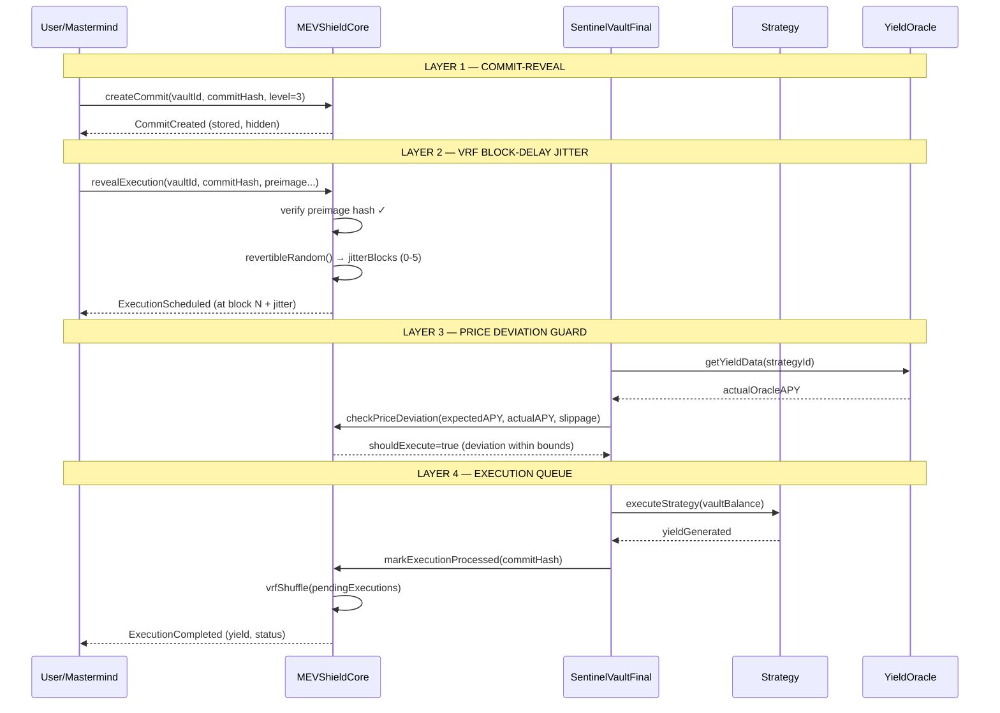
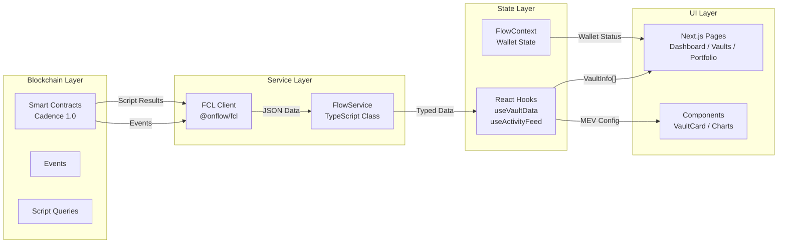
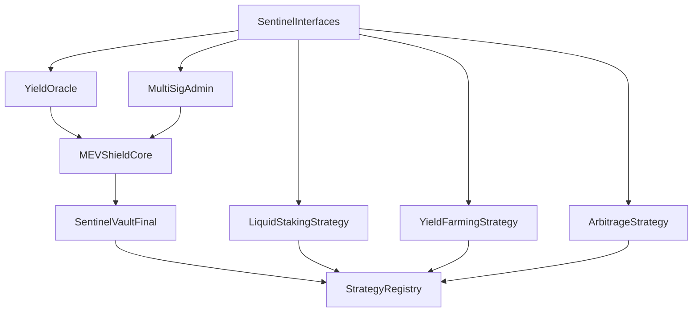

<p align="center">
  
</p>

<h1 align="center">🛡️ Flow Sentinel</h1>

<p align="center">
  <b>The Autonomous, MEV-Resistant Wealth Manager on Flow Blockchain</b>
</p>

<p align="center">
  <a href="https://flow.com"></a>
  <a href="https://cadence-lang.org"></a>
  <a href="https://nextjs.org"></a>
  <a href=""></a>
  <a href="./LICENSE.txt"></a>
</p>

<p align="center">
  <i>Transform static liquidity into autonomous, MEV-protected capital — with zero daily maintenance.</i>
</p>

<br />

---

## 📋 Table of Contents

- [📋 Table of Contents](#-table-of-contents)
- [🚩 The Problem](#-the-problem)
- [💡 The Solution](#-the-solution)
  - [MEV Resistance Architecture](#mev-resistance-architecture)
- [🌟 What Makes Flow Sentinel Unique](#-what-makes-flow-sentinel-unique)
- [🏗️ System Architecture](#️-system-architecture)
  - [Contract Architecture](#contract-architecture)
  - [MEV-Shield Pro — 4 Protection Layers](#mev-shield-pro--4-protection-layers)
  - [MEV Protection Flow](#mev-protection-flow)
- [🔄 User Workflow](#-user-workflow)
- [🛠️ Technical Stack](#️-technical-stack)
- [📁 Project Structure](#-project-structure)
- [🚀 Getting Started](#-getting-started)
  - [Prerequisites](#prerequisites)
  - [Local Development](#local-development)
  - [Environment Variables](#environment-variables)
- [🧪 Testing](#-testing)
  - [Run the MEV Protection Test Suite](#run-the-mev-protection-test-suite)
  - [On-Chain Verification](#on-chain-verification)
- [📜 Smart Contracts](#-smart-contracts)
  - [Core Contracts](#core-contracts)
  - [Strategy Contracts](#strategy-contracts)
  - [Transactions](#transactions)
  - [Deployment Order](#deployment-order)
- [📊 MEV Protection (Full Technical Deep Dive)](#-mev-protection-full-technical-deep-dive)
  - [Layer 1 — Commit-Reveal (🔴 Mempool Frontrunning)](#layer-1--commit-reveal--mempool-frontrunning)
  - [Layer 2 — VRF Block-Delay Jitter (⏱️ Timing Games)](#layer-2--vrf-block-delay-jitter-️-timing-games)
  - [Layer 3 — Price Deviation Guard (💹 Price Manipulation)](#layer-3--price-deviation-guard--price-manipulation)
  - [Layer 4 — Execution Queue (🔄 Sandwich Attacks)](#layer-4--execution-queue--sandwich-attacks)
- [🔬 MEV Protection Comparison](#-mev-protection-comparison)
- [🗺️ Roadmap](#️-roadmap)
- [📄 License](#-license)

---

## 🚩 The Problem

Decentralized Finance (DeFi) is one of the most transformative innovations in finance — yet it remains inaccessible to the masses due to three fundamental broken pillars:

### 🔴 The Invisible Tax of MEV
Every on-chain transaction is visible in the public mempool before it's confirmed. **Maximal Extractable Value (MEV)** bots continuously scan this mempool, identifying profitable transactions to:

- **Frontrun**: Buy an asset seconds before your large purchase, then dump it on you at a higher price
- **Sandwich**: Place a buy order before your transaction and a sell order immediately after, skimming profit from both sides
- **Backrun**: Exploit the price impact of your transaction for arbitrage

This invisible tax extracts **>$500M annually** from DeFi users, disproportionately hurting larger trades and automated strategies.

### 🔴 Fragmented Complexity
DeFi yield opportunities are scattered across hundreds of protocols:

- Liquid Staking (Lido, Stader, EigenLayer)
- DEX Liquidity Pools (Uniswap, Balancer, Trader Joe)
- Yield Aggregators (Yearn, Beefy, Harvest)
- Lending Markets (Aave, Compound, Morpho)

Managing positions across all these protocols requires constant attention — claiming rewards, restaking, rebalancing, and monitoring — creating unsustainable **manual fatigue**.

### 🔴 Capital Inefficiency
Most DeFi users hold their assets in simple wallets, earning zero yield, because the complexity of active management outweighs the perceived benefits. **Static liquidity** fails to participate in the broader economy, leaving billions in idle capital.

### 🔴 UX Friction for Institutions
Institutional adoption of DeFi is stalled by:
- Complex wallet interactions and seed phrase management
- Lack of passkey/biometric authorization
- No auditable, transparent execution trail
- No MEV guarantees for large capital deployments

---

## 💡 The Solution

**Flow Sentinel** transforms static liquidity into autonomous, MEV-protected capital. Think of it as a **self-driving car for your crypto assets** — once you define your strategy and deposit capital, the Sentinel handles everything autonomously on-chain.

### Core Innovation: MEV Resistance by Architecture

Flow Sentinel is the **first DeFi wealth manager to implement a full 4-layer MEV protection stack** directly on the Flow Blockchain, inspired by Flashbots MEV-Boost (Ethereum's gold standard) but adapted for Flow's unique Cadence 1.0 runtime.

| Concept | Problem | Flow Sentinel Solution |
|---------|---------|----------------------|
| **Mempool Frontrunning** | Bots see and frontrun your transactions | **Commit-Reveal**: Execution hash is committed first, revealed later — bots can't see what you're doing |
| **Timing Games** | Bots predict and exploit execution timing | **VRF Block-Delay Jitter**: Random 0-5 block delay using Flow's native verifiable randomness — unpredictable timing |
| **Price Manipulation** | Bots manipulate oracles before your trade | **Price Deviation Guard**: Expected APY vs real-time oracle APY — trades abort if deviation exceeds configured slippage (default 3%) |
| **Sandwich Attacks** | Bots sandwich large trades | **Execution Queue**: VRF-shuffled processing order — nobody knows which trade executes when |

### Beyond MEV Protection

Flow Sentinel also delivers:

- **🤖 Zero-Click Automation**: Once configured, vaults autonomously execute strategies on-chain — harvest yields, restake rewards, rebalance positions
- **🔐 Passkey Authorization**: Biometric (FaceID/TouchID) vault operations for institutional-grade security
- **📊 Bloomberg-Terminal UI**: Professional-grade dashboard with real-time P&L, vault analytics, and strategy performance tracking
- **🔗 Verifiable On-Chain History**: Every yield harvest, rebalance, and protection trigger is a transparent, explorable on-chain event
- **⚡ Multi-Strategy Execution**: Liquid Staking, Yield Farming, and Arbitrage — all managed from a single vault interface

---

## 🌟 What Makes Flow Sentinel Unique

### 1. **Flow-Native MEV Protection**
The only wealth manager to implement **Flashbots-inspired MEV resistance** directly in Cadence 1.0 smart contracts. We don't just talk about MEV protection — we deliver it in 4 verifiable, on-chain layers.

### 2. **VRF-Powered Security**
Leveraging Flow's native `revertibleRandom()` for every critical operation:
- Commit-reveal nonce generation
- Block-delay jitter (unpredictable execution timing)
- Execution queue shuffling (prevents sandwich attacks)

### 3. **Zero-Daily-Maintenance Architecture**
Unlike traditional DeFi positions that require daily claiming, restaking, and monitoring, Flow Sentinel vaults execute autonomously on-chain:
- `executeStrategyWithMEV()` is the single entry point for all strategy execution
- MEV protection is applied automatically to every execution
- Yield accrues transparently in the vault, claimable at any time

### 4. **Institutional-Grade UX from Day One**
- Passkey/biometric vault authorization (via WebAuthn)
- Professional analytics dashboard with real-time P&L charts
- Configurable MEV protection levels (None → Basic → Standard → Full)
- Auditor-friendly: every operation emits structured, explorable events

### 5. **Production-Ready Testnet Deployment**
- All 10 contracts deployed and verified on Flow Testnet
- Full 4-layer MEV protection test suite passing
- TypeScript frontend with zero compilation errors
- Next.js 15 with App Router for optimal performance

---

## 🏗️ System Architecture

### Contract Architecture

```
┌────────────────────────────────────────────────────────────────────┐
│                        Flow Sentinel                                │
├──────────────────────┬──────────────────────┬──────────────────────┤
│   Core Contracts     │   MEV Protection     │   Strategies          │
│                      │                      │                      │
│  SentinelVaultFinal  │   MEVShieldCore      │  LiquidStakingStrat   │
│  ┌──────────────┐    │   ┌──────────────┐    │  ┌──────────────┐    │
│  │    Vault     │    │   │  Commits     │    │  │  Execute()   │    │
│  │  Resource    │───▶│   │  Dictionary  │    │  │              │    │
│  │  (per-user)  │    │   └──────────────┘    │  └──────────────┘    │
│  └──────────────┘    │   ┌──────────────┐    │  ┌──────────────┐    │
│  ┌──────────────┐    │   │  Pending     │    │  │ YieldFarming │    │
│  │  Collection  │    │   │  Executions  │    │  │  Strategy    │    │
│  │  Resource    │───▶│   └──────────────┘    │  └──────────────┘    │
│  └──────────────┘    │   ┌──────────────┐    │  ┌──────────────┐    │
│                      │   │  VaultMEV    │    │  │  Arbitrage   │    │
│  SentinelInterfaces  │   │  Configs     │    │  │  Strategy    │    │
│  ┌──────────────┐    │   └──────────────┘    │  └──────────────┘    │
│  │  IStrategy   │    │                      │                      │
│  └──────────────┘    │   MultiSigAdmin       │   StrategyRegistry   │
│                      │   ┌──────────────┐    │   ┌──────────────┐    │
│  SentinelVaultFinal  │   │  Admin       │    │   │  Strategy    │    │
│  (V2)                │   │  Multi-Sig   │    │   │  Catalog     │    │
│                      │   └──────────────┘    │   └──────────────┘    │
└──────────────────────┴──────────────────────┴──────────────────────┘
```

### MEV-Shield Pro — 4 Protection Layers

```
                    ╔═══════════════════════════════╗
                    ║     MEV-SHIELD PRO            ║
                    ║   Full Protection Active      ║
                    ╚═══════════════════════════════╝
                             │
          ┌──────────────────┼──────────────────┐
          ▼                  ▼                  ▼
   ┌──────────────┐  ┌──────────────┐  ┌──────────────┐
   │  Layer 1     │  │  Layer 2     │  │  Layer 3     │
   │ Commit-Reveal│  │ VRF Block-   │  │ Price        │
   │              │  │ Delay Jitter │  │ Deviation    │
   │ Execution    │  │ Random 0-5   │  │ Guard        │
   │ hidden from  │  │ block delay  │  │ APY ± slippage│
   │ mempool      │  │ (unpredict.) │  │ tolerance    │
   └──────────────┘  └──────────────┘  └──────────────┘
                                             │
                                             ▼
                                      ┌──────────────┐
                                      │  Layer 4     │
                                      │ Execution    │
                                      │ Queue        │
                                      │ VRF-shuffled │
                                      │ order        │
                                      └──────────────┘
```

### MEV Protection Flow


```mermaid
sequenceDiagram
    participant U as User/Mastermind
    participant C as MEVShieldCore
    participant V as SentinelVaultFinal
    participant S as Strategy
    participant O as YieldOracle

    Note over U,O: LAYER 1 — COMMIT-REVEAL
    U->>C: createCommit(vaultId, commitHash, level=3)
    C-->>U: CommitCreated (stored, hidden)

    Note over U,O: LAYER 2 — VRF BLOCK-DELAY JITTER
    U->>C: revealExecution(vaultId, commitHash, preimage...)
    C->>C: verify preimage hash ✓
    C->>C: revertibleRandom() → jitterBlocks (0-5)
    C-->>U: ExecutionScheduled (at block N + jitter)

    Note over U,O: LAYER 3 — PRICE DEVIATION GUARD
    V->>O: getYieldData(strategyId)
    O-->>V: actualOracleAPY
    V->>C: checkPriceDeviation(expectedAPY, actualAPY, slippage)
    C-->>V: shouldExecute=true (deviation within bounds)

    Note over U,O: LAYER 4 — EXECUTION QUEUE
    V->>S: executeStrategy(vaultBalance)
    S-->>V: yieldGenerated
    V->>C: markExecutionProcessed(commitHash)
    C->>C: vrfShuffle(pendingExecutions)
    C-->>U: ExecutionCompleted (yield, status)
```

### User → Vault → Strategy Flow

```mermaid
graph TD
    User((User)) -->|1. Create Vault<br/>(with MEV config)| CreateVault[SentinelVaultFinal.createVault]
    CreateVault -->|2. Register| MEV[MEVShieldCore.registerVaultMEV]
    CreateVault -->|3. Store| Collection[(VaultCollection)]
    
    User -->|4. Deposit FLOW| Deposit[SentinelVaultFinal.deposit]
    Deposit --> Vault[(Vault Resource)]
    
    User -->|5. Trigger Strategy| Trigger[mev_reveal / mev_execute]
    Trigger -->|6. Create Commit| MEV
    MEV -->|7. Reveal + VRF Jitter| MEV
    
    subgraph "MEV-Protected Execution"
        MEV -->|8. Price Guard| Vault
        Vault -->|9. Execute| Strategy{Strategy Engine}
        Strategy -->|10a. Stake| LST[Liquid Staking]
        Strategy -->|10b. Farm| Farm[Yield Farming]
        Strategy -->|10c. Arbitrage| Arb[DEX Arbitrage]
    end
    
    Strategy -->|11. Yield Generated| Vault
    Vault -->|12. Event Emitted| Chain[(On-Chain Log)]
    
    User -.->|Query Vault Info| Script[get_vault_info.cdc]
    Script -- MEV Stats --> User
```

### Data Flow Architecture


```mermaid
graph LR
    subgraph "Blockchain Layer"
        SC[Smart Contracts<br/>Cadence 1.0]
        EV[Events]
        ST[Script Queries]
    end
    
    subgraph "Service Layer"
        FCL[FCL Client<br/>@onflow/fcl]
        FSV[FlowService<br/>TypeScript Class]
    end
    
    subgraph "State Layer"
        Hooks[React Hooks<br/>useVaultData<br/>useActivityFeed]
        CTX[FlowContext<br/>Wallet State]
    end
    
    subgraph "UI Layer"
        Pages[Next.js Pages<br/>Dashboard / Vaults / Portfolio]
        Comp[Components<br/>VaultCard / Charts]
    end
    
    SC -- Events --> FCL
    SC -- Script Results --> FCL
    FCL -- JSON Data --> FSV
    FSV -- Typed Data --> Hooks
    Hooks -- VaultInfo[] --> Pages
    Hooks -- MEV Config --> Comp
    CTX -- Wallet Status --> Pages
```

---

## 🔄 User Workflow

### 1. **Connect Wallet**
Choose Flow Wallet (native Cadence) or EVM Gateway (MetaMask/RainbowKit)

### 2. **Create a Vault**
```bash
# Via the CLI or frontend:
flow transactions send transactions/init_sentinel.cdc \
    --args-json '[
        {"type": "String", "value": "My MEV-Protected Vault"},
        {"type": "String", "value": "Liquid Staking Pro"},
        {"type": "String", "value": "liquid-staking-pro"}
    ]' --network testnet
```

Your vault is created with **Full MEV Protection (Level 3)** by default:
- ✅ Layer 1 — Commit-Reveal: Active
- ✅ Layer 2 — VRF Block-Delay: Active  
- ✅ Layer 3 — Price Deviation Guard: Active (3% slippage)
- ✅ Layer 4 — Execution Queue: Active

### 3. **Deposit Capital**
Deposit FLOW tokens into your vault. The vault balance is tracked on-chain.

### 4. **Trigger Strategy Execution (MEV-Protected)**
Two options:

**🔴 Full Protection (Recommended):** Commit-Reveal flow
```bash
# Step 1: Generate commit hash off-chain
# Step 2: Commit (hash hidden from mempool)
flow transactions send transactions/mev_commit.cdc \
    --args-json '[
        {"type": "UInt64", "value": "0"},
        {"type": "String", "value": "SENTINEL-MEV-COMMIT:0:12345:100.0:liquid-staking-pro:1000000:0xc13..."},
        {"type": "UInt8", "value": "3"}
    ]' --network testnet

# Step 3: Reveal + Execute (after commit window)
flow transactions send transactions/mev_reveal.cdc \
    --args-json '[...preimage params...]' --network testnet
```

**🟡 Standard Protection:** Direct execution with VRF jitter + price guard
```bash
flow transactions send transactions/mev_execute_direct.cdc \
    --args-json '[...]' --network testnet
```

### 5. **Monitor & Claim**
Use the web dashboard to:
- View real-time vault balance and yield accrued
- Monitor MEV protection triggers and rejections
- Adjust protection level (None → Basic → Standard → Full)
- Claim accumulated yield
- View performance history with P&L charts

---

## 🛠️ Technical Stack

| Layer | Technology | Purpose |
|:------|:-----------|:--------|
| **Blockchain** | [Flow (Cadence 1.0)](https://cadence-lang.org) | Smart contract runtime with native randomness |
| **Smart Contracts** | 10 Cadence contracts | Vault logic, MEV protection, strategy execution |
| **Web Framework** | [Next.js 15](https://nextjs.org) (App Router) | SSR, React Server Components, optimized builds |
| **UI Library** | [React 19](https://react.dev) | Component-based UI architecture |
| **Styling** | [Tailwind CSS 4](https://tailwindcss.com) | Utility-first CSS with glassmorphism design |
| **Animations** | [Framer Motion](https://framer.com/motion) | 60FPS interactive UI animations |
| **Wallet Connect** | [FCL](https://developers.flow.com/tools/fcl-js) + [RainbowKit](https://rainbowkit.com) | Flow Wallet + EVM wallet support |
| **Diagrams** | [Mermaid](https://mermaid.js.org) | Architecture diagrams in README |
| **Deployment** | [Netlify](https://netlify.com) | Edge functions + SSR |
| **Flow CLI** | [flow-cli](https://developers.flow.com/tools/flow-cli) | Contract deployment, scripts, transactions |

---

## 📁 Project Structure

```
Flow-Sentinel/
├── app/                          # Next.js 15 App Router pages
│   ├── dashboard/                # Main dashboard with vault management
│   ├── vaults/                   # Vault list and details
│   ├── portfolio/                # Portfolio analytics
│   ├── analytics/                # Performance analytics
│   ├── settings/                 # User settings
│   ├── docs/                     # Documentation
│   ├── landing/                  # Marketing landing page
│   └── page.tsx                  # Root page
├── components/
│   ├── dashboard/                # VaultCard, CreateVaultModal, Charts
│   ├── immersive/                # Particle fields, animated text, cards
│   ├── layout/                   # Navbar, Footer
│   └── ui/                       # Reusable UI primitives
├── contracts/
│   ├── MEVShieldCore.cdc         # ⭐ 4-layer MEV protection engine
│   ├── SentinelVaultV2.cdc       # ⭐ MEV-protected vault (deployed as SentinelVaultFinal)
│   ├── SentinelInterfaces.cdc    # Core interfaces
│   ├── StrategyRegistry.cdc      # Strategy catalog
│   ├── YieldOracle.cdc           # Yield data oracle
│   ├── MultiSigAdmin.cdc         # Multi-sig admin
│   └── strategies/               # Strategy implementations
│       ├── LiquidStakingStrategy.cdc
│       ├── YieldFarmingStrategy.cdc
│       └── ArbitrageStrategy.cdc
├── transactions/                 # Cadence transactions
│   ├── mev_commit.cdc            # Layer 1: Create commit hash
│   ├── mev_reveal.cdc            # Layer 1-4: Reveal + execute
│   ├── mev_execute_direct.cdc    # Direct execution with MEV
│   ├── mev_set_protection.cdc    # Update protection level
│   ├── init_sentinel.cdc         # Initialize vault
│   └── ...
├── scripts/                      # Shell & Cadence scripts
│   ├── test_mev_protection.sh    # ⭐ Full MEV test suite
│   ├── mev_status.cdc            # Query MEV stats
│   ├── get_vault_info.cdc        # Query vault info
│   ├── deploy-all-contracts.sh   # Deploy all contracts
│   └── verify_deployment.js      # Verify deployment
├── hooks/                        # React hooks
│   ├── useVaultData.ts           # Vault data with MEV fields
│   └── useActivityFeed.ts        # On-chain event feed
├── lib/
│   ├── flow-service.ts           # Cadence transaction templates
│   ├── flow.tsx                  # FCL configuration + FlowProvider
│   └── wagmi.ts                  # EVM wallet config
├── flow.json                     # Flow CLI config (networks, accounts, contracts)
├── .env.local.example            # Environment variable template
├── netlify.toml                  # Netlify deployment config
└── README.md                     # This file
```

---

## 🚀 Getting Started

### Prerequisites

- Node.js 18+ and npm/pnpm/yarn
- [Flow CLI](https://developers.flow.com/tools/flow-cli/install) (`flow` command in PATH)
- A Flow wallet (e.g., [Flow Wallet](https://wallet.flow.com/) browser extension)
- (Optional) A testnet account with FLOW tokens from the [Flow Testnet Faucet](https://testnet-faucet.onflow.org/)

### Local Development

```bash
# 1. Clone the repository
git clone https://github.com/Aaditya1273/Flow-Sentinel.git
cd Flow-Sentinel

# 2. Install dependencies
npm install

# 3. Copy environment configuration
cp .env.local.example .env.local
# Edit .env.local with your values (defaults work for testnet)

# 4. Start the development server
npm run dev
# Open http://localhost:3000

# 5. (Optional) Deploy contracts to testnet
flow deploy --network testnet

# 6. (Optional) Run the MEV test suite
bash scripts/test_mev_protection.sh testnet
```

### Environment Variables

See `.env.local.example` for the complete list. Key variables:

| Variable | Default (Testnet) | Mainnet |
|:---------|:------------------|:--------|
| `NEXT_PUBLIC_FLOW_ACCESS_NODE` | `https://rest-testnet.onflow.org` | `https://rest-mainnet.onflow.org` |
| `NEXT_PUBLIC_SENTINEL_VAULT_ADDRESS` | `0xc13b08053be24e87` | Deploy-specific |
| `NEXT_PUBLIC_SENTINEL_INTERFACES_ADDRESS` | `0x136b642d0aa31ca9` | Deploy-specific |
| `NEXT_PUBLIC_WALLET_CONNECT_PROJECT_ID` | Your project ID | Your project ID |
| `NEXT_PUBLIC_FLOW_TOKEN_ADDRESS` | `0x7e60df042a9c0868` | `0x1654653399040a61` |
| `NEXT_PUBLIC_FUNGIBLE_TOKEN_ADDRESS` | `0x9a0766d93b6608b7` | `0xf233dcee88fe0abe` |

---

## 🧪 Testing

### Run the MEV Protection Test Suite

The test suite verifies all 4 layers of MEV protection on-chain:

```bash
bash scripts/test_mev_protection.sh testnet
```

This will:
1. ✅ Verify MEVShieldCore deployment
2. ✅ Create a vault with Full MEV protection
3. ✅ **Layer 1**: Commit a hash (hidden from mempool)
4. ✅ **Layer 2**: Reveal + VRF block-delay jitter applied
5. ✅ **Layer 3**: Price deviation guard check
6. ✅ **Layer 4**: Execution queue tracking
7. ✅ Query and verify MEV statistics
8. ✅ Update protection level settings

### On-Chain Verification

```bash
# Query global MEV stats
flow scripts execute scripts/mev_status.cdc nil --network testnet

# Query vault-specific MEV config
flow scripts execute scripts/mev_status.cdc 0 --network testnet

# Query all vault info
flow scripts execute scripts/get_vault_info.cdc 0xc13b08053be24e87 --network testnet
```

### TypeScript & Build Validation

```bash
# TypeScript type checking
npx tsc --noEmit

# Full Next.js build
npx next build
```

---

## 📜 Smart Contracts

### Core Contracts

| Contract | Address (Testnet) | Description |
|:---------|:------------------|:------------|
| **MEVShieldCore** | `0xc13b08053be24e87` | 4-layer MEV protection engine — commit-reveal, VRF jitter, price guard, execution queue |
| **SentinelVaultFinal** | `0xc13b08053be24e87` | MEV-protected vault (V2) with full protection integration |
| **SentinelInterfaces** | `0x136b642d0aa31ca9` | Core interfaces: `IMEVShield`, `IStrategy` |
| **StrategyRegistry** | `0xc13b08053be24e87` | Strategy catalog — register, query, and update strategy TVL |
| **YieldOracle** | `0xc13b08053be24e87` | Yield data provider for price deviation guard |
| **MultiSigAdmin** | `0xc13b08053be24e87` | Multi-signature administration for yield reserve |

### Strategy Contracts

| Strategy | Description |
|:---------|:------------|
| **LiquidStakingStrategy** | Delegates FLOW to liquid staking protocols, generates staking yield with VRF-driven variance |
| **YieldFarmingStrategy** | Harvests and compounds yields from DeFi farming protocols |
| **ArbitrageStrategy** | Executes arbitrage opportunities across DEX aggregators |

### Transactions

| Transaction | Purpose |
|:------------|:--------|
| `mev_commit.cdc` | Create a commit hash (Layer 1 — hide execution from mempool) |
| `mev_reveal.cdc` | Reveal hash, apply VRF jitter, check price deviation, execute (Layers 1-4) |
| `mev_execute_direct.cdc` | Direct execution with VRF jitter + price guard (no commit-reveal) |
| `mev_set_protection.cdc` | Update vault protection level and slippage tolerance |
| `init_sentinel.cdc` | Initialize a new vault with MEV protection |
| `deposit_flow.cdc` | Deposit FLOW tokens into a vault |
| `withdraw_flow.cdc` | Withdraw FLOW tokens from a vault |

### Deployment Order

Contracts must be deployed in this order (dependency chain):


```mermaid
graph TD
    A[SentinelInterfaces] --> B[YieldOracle]
    A --> C[MultiSigAdmin]
    B --> D[MEVShieldCore]
    C --> D
    D --> E[SentinelVaultFinal]
    A --> F[LiquidStakingStrategy]
    A --> G[YieldFarmingStrategy]
    A --> H[ArbitrageStrategy]
    E --> I[StrategyRegistry]
    F --> I
    G --> I
    H --> I
```

```bash
# Deploy everything in one command (using flow.json config)
flow deploy --network testnet --update
```

---

## 📊 MEV Protection (Full Technical Deep Dive)

### Layer 1 — Commit-Reveal (🔴 Mempool Frontrunning)

**Concept**: Adapted from Flashbots' Proposer-Builder Separation (PBS). Instead of submitting the actual execution parameters to the mempool where bots can see them, the user first submits a **commitment hash** — a one-way hash of the execution preimage. The actual execution details are revealed later, after the commit has been confirmed.

**Cadence Implementation**:
```cadence
// Step 1: Commit (only the hash is visible on-chain)
MEVShieldCore.createCommit(
    vaultId: vaultId,
    commitHash: commitHash,  // "SENTINEL-MEV-COMMIT:<vaultId>:<nonce>:..."
    protectionLevel: 3
)

// Step 2: Reveal + Execute (after commit window)
// The preimage is verified against the stored hash
MEVShieldCore.revealExecution(
    vaultId: vaultId,
    commitHash: commitHash,
    nonce: nonce,
    amount: amount,
    strategyId: strategyId,
    deadlineBlock: deadlineBlock,
    expectedAPY: expectedAPY,
    slippageBps: slippageBps
)
```

**Security Properties**:
- ✅ Execution is **hidden from mempool** until the commit is confirmed
- ✅ Preimage includes a **random nonce** (generated via `revertibleRandom()`) — unpredictable
- ✅ Commit has a **200-block deadline window** (~3 minutes) — enough time for honest reveal
- ✅ Commits are **one-time use** — once revealed, the hash cannot be reused
- ✅ Expired commits are automatically cleaned up

### Layer 2 — VRF Block-Delay Jitter (⏱️ Timing Games)

**Concept**: Even if an execution is revealed, a sophisticated MEV bot could predict its exact execution time and frontrun it. Flow Sentinel uses Flow's native `revertibleRandom()` to add a random delay of 0-5 blocks before execution — making the exact execution time unpredictable.

**Cadence Implementation**:
```cadence
let jitterBlocks = revertibleRandom<UInt64>() % (self.getMEVDelayMax() + 1)
let executeAtBlock = currentBlock + jitterBlocks + 1

emit ExecutionScheduled(
    vaultId: vaultId,
    executeAtBlock: executeAtBlock,
    jitterBlocks: jitterBlocks
)
```

**Security Properties**:
- ✅ **Unpredictable timing** — `revertibleRandom()` is verifiable, non-deterministic randomness from Flow consensus
- ✅ 0-5 blocks delay — short enough for acceptable UX, long enough to break bot timing
- ✅ **Configurable max delay** via `getMEVDelayMax()` — can be updated without redeployment

### Layer 3 — Price Deviation Guard (💹 Price Manipulation)

**Concept**: Before executing any strategy, the vault fetches the **actual APY** from the YieldOracle and compares it against the **expected APY** provided by the user. If the deviation exceeds the configured slippage tolerance (default 3% = 300 bps), the execution is rejected and the MEV attack is prevented.

**Cadence Implementation**:
```cadence
// Fetch real-time oracle data
let oracleData = YieldOracle.getYieldData(self.strategyId)
let actualOracleAPY = oracleData?.apy ?? expectedAPY

// Check deviation against slippage tolerance
let oracleCheck = MEVShieldCore.checkPriceDeviation(
    vaultId: self.id,
    expectedAPY: expectedAPY,
    actualOracleAPY: actualOracleAPY,
    slippageBps: self.slippageBps  // e.g., 300 = 3%
)

if !oracleCheck.shouldExecute {
    // Execution rejected — MEV protection triggered!
    emit MEVExecutionGuard(
        vaultId: self.id,
        deviation: oracleCheck.deviation,
        allowed: false,
        reason: "Price deviation exceeds bounds"
    )
    return  // Abort execution
}
```

**Security Properties**:
- ✅ **Real-time oracle data** — fetches current APY at execution time, not cached
- ✅ **Configurable slippage** — vault-level setting, independent per vault
- ✅ **Hard upper bound** — `MEV_DEVIATION_TOLERANCE` (50%) as absolute limit
- ✅ **Auditable** — every guard trigger emits a structured event with deviation and reason

### Layer 4 — Execution Queue (🔄 Sandwich Attacks)

**Concept**: When multiple executions are pending, they are processed through a queue that is **shuffled using VRF randomness** — ensuring no attacker can predict which execution will be processed first, effectively preventing sandwich attacks.

**Cadence Implementation**:
```cadence
// VRF-shuffled execution queue
access(self) fun vrfShuffle(_ items: [PendingExecution]): [PendingExecution] {
    if items.length <= 1 { return items }
    var shuffled: [PendingExecution] = []
    var remaining = items
    while remaining.length > 0 {
        let randomIndex = revertibleRandom<UInt64>() % UInt64(remaining.length)
        shuffled.append(remaining[randomIndex])
        // Remove selected element
        var newRemaining: [PendingExecution] = []
        for i, item in remaining {
            if UInt64(i) != randomIndex { newRemaining.append(item) }
        }
        remaining = newRemaining
    }
    return shuffled
}
```

**Security Properties**:
- ✅ **VRF-shuffled order** — nobody knows which execution processes next
- ✅ **Fisher-Yates algorithm** — unbiased shuffling, every permutation equally likely
- ✅ **Ready-only** — only executions past their scheduled block are included

### MEV Protection Configuration Per Vault

Each vault has independent MEV protection settings:

```cadence
// Protection level 0-3
vault.setProtectionLevel(newLevel: 3)  // Full protection

// Slippage tolerance in basis points
vault.setSlippageBps(newSlippageBps: 300.0)  // 3%

// Protection levels:
// 0 = None      — MEV protection DISABLED
// 1 = Basic     — VRF Block-Delay Jitter only
// 2 = Standard  — Commit-Reveal + Block-Delay Jitter  
// 3 = Full      — All 4 layers active ✅ (DEFAULT)
```

The vault's `executeStrategyWithMEV()` function automatically applies the correct protection layers based on the vault's configured level:

```cadence
access(StrategyExecution) fun executeStrategyWithMEV(
    executor: @{SentinelInterfaces.IStrategy},
    commitHash: String,
    expectedAPY: UFix64,
    nonce: UInt64
) {
    // Layer 1: Commit-Reveal guard (if enabled)
    // Layer 2: VRF block-delay jitter (if enabled)
    // Layer 3: Price deviation check (always for level >= 1)
    // Layer 4: Execution queue processing (always)
    // Execute strategy
}
```

---

## 🔬 MEV Protection Comparison

| Feature | Flow Sentinel | Typical DeFi Protocol | Ethereum mev-boost |
|:--------|:-------------|:---------------------|:-------------------|
| Commit-Reveal Execution | ✅ Cadence-native | ❌ | ✅ (PBS) |
| VRF Randomness | ✅ `revertibleRandom()` | ❌ | ❌ (external oracles) |
| Price Deviation Guard | ✅ On-chain oracle | ❌ | ✅ (Relay mux) |
| Execution Queue | ✅ VRF-shuffled | ❌ | ❌ |
| Per-Vault Protection Config | ✅ Yes | ❌ | ❌ |
| Native Flow Integration | ✅ Yes | ❌ | ❌ (Ethereum only) |
| Off-Chain Dependencies | ❌ Zero | Varies | Required (relays) |

---

## 🗺️ Roadmap

- [x] **Phase 1**: Core Vault Logic & Testnet Deployment
- [x] **Phase 2**: MEV-Shield Pro — 4-Layer Protection
- [x] **Phase 3**: Professional Analytics Dashboard
- [ ] **Phase 4**: Multi-sig Governance for Community Vaults
- [ ] **Phase 5**: Mainnet Launch
- [ ] **Phase 6**: Institutional API & SDK

---

## 📄 License

This project is licensed under the MIT License - see the [LICENSE](./LICENSE.txt) file for details.

---

<p align="center">
  <b>Built for the future of finance on the Flow Blockchain</b>
  <br />
  <i>Flow Sentinel — Where DeFi meets Autonomy</i>
  <br /><br />
  <a href="https://codebuff.com">Built with Codebuff</a>
  ·
  <a href="https://flow.com">Flow Blockchain</a>
  ·
  <a href="https://cadence-lang.org">Cadence Language</a>
</p>
