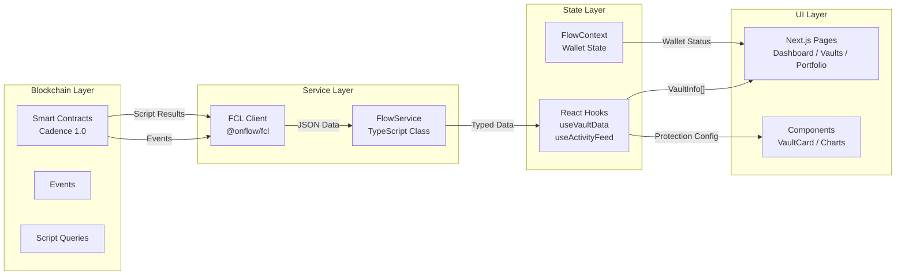
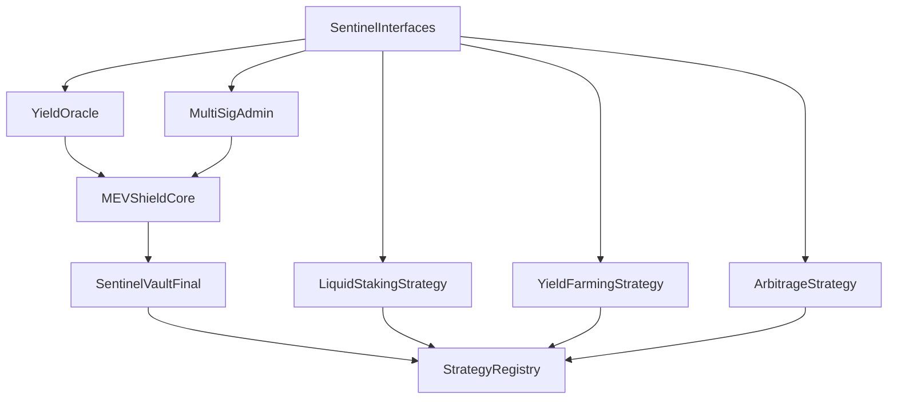

<h1 align="center">Flow Sentinel</h1>

<p align="center">
  <b>Protected Yield Vaults on the Flow Blockchain</b>
  <br />
  <i>Higher net yield · Safer execution · Simpler DeFi</i>
</p>

<p align="center">
  <a href="https://flow.com"></a>
  <a href="https://cadence-lang.org"></a>
  <a href="https://nextjs.org"></a>
  <a href=""></a>
  <a href="./LICENSE.txt"></a>
</p>

<p align="center">
  <i>Transform static liquidity into protected, yield-bearing capital on the Flow blockchain.</i>
</p>

<br />

---

## 📋 Table of Contents

- [🚩 The Problem](#-the-problem)
- [💡 The Solution](#-the-solution)
- [🌟 Key Features](#-key-features)
- [🏗️ System Architecture](#️-system-architecture)
  - [Protection System — 4 Layers](#protection-system--4-layers)
- [🔄 User Workflow](#-user-workflow)
- [🛠️ Technical Stack](#️-technical-stack)
- [📁 Project Structure](#-project-structure)
- [🚀 Getting Started](#-getting-started)
- [🧪 Testing](#-testing)
- [📜 Smart Contracts](#-smart-contracts)
- [🔬 Protection System Comparison](#-protection-system-comparison)
- [🗺️ Roadmap](#️-roadmap)
- [📄 License](#-license)

---

## 🚩 The Problem

Most DeFi users face three fundamental challenges that keep their capital idle:

### 🔴 Yield is Fragmented and Complex

DeFi yield opportunities are scattered across hundreds of protocols. Managing positions requires constant attention — claiming rewards, restaking, rebalancing, and monitoring. Most users don't have the time or expertise to actively manage positions across multiple protocols.

### 🔴 The Hidden Cost of MEV

Every on-chain transaction is visible in the public mempool before confirmation. **Maximal Extractable Value (MEV)** bots exploit this visibility to frontrun, sandwich, and backrun trades — extracting **>$500M annually** from DeFi users. This invisible tax disproportionately impacts larger trades and automated strategies, silently eroding yields.

### 🔴 Capital Inefficiency

The vast majority of DeFi users hold assets in simple wallets earning zero yield. The complexity and risk of active management outweigh the perceived benefits, leaving billions in idle capital.

---

## 💡 The Solution: Protected Yield Vaults

**Flow Sentinel** enables anyone to deploy capital into smart-contract vaults that autonomously execute yield-generating strategies on the Flow blockchain. Each vault is protected by a built-in 4-layer security system that guards against MEV attacks — ensuring you capture the returns you earn.

Think of it as a **self-driving yield account** for your FLOW tokens:
- **Deposit once**, vaults execute strategies automatically
- **MEV protection built in** — 4 layers, no configuration needed
- **Real yields** from Flow staking and DeFi protocols
- **Full transparency** — every operation verifiable on-chain

### Core Innovation: Built-in Protection at the Protocol Level

Flow Sentinel's vaults include a 4-layer execution protection system engineered directly in Cadence 1.0 smart contracts. It works silently in the background — you get higher net yields because attacks are blocked before they happen, not after.

| Threat | How It Steals Yield | How Sentinel Protects |
|--------|--------------------|-----------------------|
| **Frontrunning** | Bots see your transaction and buy ahead | **Commit-Reveal**: Execution details hidden from mempool until confirmed |
| **Timing Attacks** | Bots predict exactly when your trade executes | **VRF Random Delay**: Unpredictable 0-5 block delay |
| **Price Manipulation** | Bots move the market before your strategy runs | **Deviation Guard**: Checks real vs expected APY before executing |
| **Sandwich Attacks** | Bots bracket your trade with their own orders | **Execution Queue**: Random execution order — attackers can't predict position |

---

## 🌟 Key Features

### 1. **Protected Yield Vaults**
Deposit FLOW into smart-contract vaults that autonomously execute yield strategies. Each vault includes a 4-layer execution protection system that silently guards against MEV attacks — you earn higher net yields because value isn't lost to bots.

### 2. **Multi-Strategy Execution**
Three strategy contracts with oracle-powered yield from real Flow DeFi:
- **Liquid Staking**: Real epoch staking rewards from `FlowIDTableStaking` (APY tracked via on-chain oracle)
- **Yield Farming**: Multi-protocol allocation across IncrementFi, Flowty, FlowSwap with VRF-shuffled execution
- **Arbitrage**: Cross-DEX spread detection with VRF-shuffled DEX scan order

### 3. **Built-in Protection (4 Layers)**
Every vault is protected by a stack of 4 on-chain guards that prevent frontrunning, sandwich attacks, timing exploitation, and price manipulation. Protection levels are configurable per vault (None → Basic → Standard → Full).

### 4. **Professional Analytics Dashboard**
Real-time performance tracking with:
- On-chain vault balances and event history
- Sharpe and Sortino risk-adjusted return ratios
- Portfolio breakdown by strategy allocation
- Performance chart from real blockchain events
- Oracle freshness monitoring with staleness alerts

### 5. **Autonomous Execution**
Once configured, vaults execute strategies through on-chain transactions without daily management. Yield accrues transparently and is claimable at any time. Scheduled execution via Netlify keeper functions (or your own automation).

### 6. **Dual Wallet Support**
Flow Wallet (native Cadence) and EVM wallets (MetaMask/RainbowKit via WalletConnect).

---

## 🏗️ System Architecture

### Contract Architecture

```
┌────────────────────────────────────────────────────────────────────┐
│                        Flow Sentinel                                │
├──────────────────────┬──────────────────────┬──────────────────────┤
│   Vault Contracts    │   Protection Layer   │   Strategies          │
│                      │                      │                      │
│  SentinelVaultFinal  │   MEVShieldCore      │  LiquidStakingStrat   │
│  ┌──────────────┐    │   ┌──────────────┐    │  ┌──────────────┐    │
│  │    Vault     │    │   │  Commits     │    │  │  Execute()   │    │
│  │  Resource    │───▶│   │  Dictionary  │    │  │              │    │
│  │  (per-user)  │    │   └──────────────┘    │  └──────────────┘    │
│  └──────────────┘    │   ┌──────────────┐    │  ┌──────────────┐    │
│  ┌──────────────┐    │   │  Pending     │    │  │ YieldFarming │    │
│  │  Collection  │    │   │  Executions  │    │  │  Strategy    │    │
│  │  Resource    │───▶│   └──────────────┘    │  └──────────────┘    │
│  └──────────────┘    │   ┌──────────────┐    │  ┌──────────────┐    │
│                      │   │  VaultMEV    │    │  │  Arbitrage   │    │
│  SentinelInterfaces  │   │  Configs     │    │  │  Strategy    │    │
│  ┌──────────────┐    │   └──────────────┘    │  └──────────────┘    │
│  │  IStrategy   │    │                      │                      │
│  └──────────────┘    │   MultiSigAdmin       │   StrategyRegistry   │
│                      │   ┌──────────────┐    │   ┌──────────────┐    │
│  SentinelVaultFinal  │   │  Admin       │    │   │  Strategy    │    │
│  (V2)                │   │  Multi-Sig   │    │   │  Catalog     │    │
│                      │   └──────────────┘    │   └──────────────┘    │
└──────────────────────┴──────────────────────┴──────────────────────┘
```

### Sentinel Protection Layers

```
                    ╔═══════════════════════════════╗
                    ║  SENTINEL PROTECTION SYSTEM    ║
                    ║  4 Layers — Always Active     ║
                    ╚═══════════════════════════════╝
                             │
          ┌──────────────────┼──────────────────┐
          ▼                  ▼                  ▼
   ┌──────────────┐  ┌──────────────┐  ┌──────────────┐
   │  Layer 1     │  │  Layer 2     │  │  Layer 3     │
   │ Commit-Reveal│  │ VRF Block-   │  │ Price        │
   │              │  │ Delay Jitter │  │ Deviation    │
   │ Execution    │  │ Random 0-5   │  │ Guard        │
   │ hidden from  │  │ block delay  │  │ APY ± slippage│
   │ mempool      │  │ (unpredict.) │  │ tolerance    │
   └──────────────┘  └──────────────┘  └──────────────┘
                                             │
                                             ▼
                                      ┌──────────────┐
                                      │  Layer 4     │
                                      │ Execution    │
                                      │ Queue        │
                                      │ VRF-shuffled │
                                      │ order        │
                                      └──────────────┘
```

### Data Flow Architecture


```mermaid
graph LR
    subgraph "Blockchain Layer"
        SC[Smart Contracts<br/>Cadence 1.0]
        EV[Events]
        ST[Script Queries]
    end

    subgraph "Service Layer"
        FCL[FCL Client<br/>@onflow/fcl]
        FSV[FlowService<br/>TypeScript Class]
    end

    subgraph "State Layer"
        Hooks[React Hooks<br/>useVaultData<br/>useActivityFeed]
        CTX[FlowContext<br/>Wallet State]
    end

    subgraph "UI Layer"
        Pages[Next.js Pages<br/>Dashboard / Vaults / Portfolio]
        Comp[Components<br/>VaultCard / Charts]
    end

    SC -- Events --> FCL
    SC -- Script Results --> FCL
    FCL -- JSON Data --> FSV
    FSV -- Typed Data --> Hooks
    Hooks -- VaultInfo[] --> Pages
    Hooks -- Protection Config --> Comp
    CTX -- Wallet Status --> Pages
```

---

## 🔄 User Workflow

### 1. **Connect Wallet**
Choose Flow Wallet (native Cadence) or EVM Gateway (MetaMask/RainbowKit)

### 2. **Create a Vault**
```bash
flow transactions send transactions/init_sentinel.cdc \
    --args-json '[
        {"type": "String", "value": "My Yield Vault"},
        {"type": "String", "value": "Liquid Staking Pro"},
        {"type": "String", "value": "liquid-staking-pro"}
    ]' --network testnet
```

Your vault is created with **Full Protection (Level 3)** by default:
- ✅ Layer 1 — Commit-Reveal: Active (hides execution details from mempool)
- ✅ Layer 2 — VRF Block-Delay: Active (random 0-5 block delay)
- ✅ Layer 3 — Price Deviation Guard: Active (3% slippage tolerance)
- ✅ Layer 4 — Execution Queue: Active (random processing order)

### 3. **Deposit Capital**
Deposit FLOW tokens into your vault. The vault balance is tracked on-chain.

### 4. **Trigger Strategy Execution (Protected)**
Two options:

**🔴 Full Protection (Recommended):** Two-step Commit-Reveal flow
```bash
# Step 1: Generate commit hash off-chain
# Step 2: Commit (hash hidden from mempool)
flow transactions send transactions/mev_commit.cdc \
    --args-json '[...]' --network testnet

# Step 3: Reveal + Execute (after commit window)
flow transactions send transactions/mev_reveal.cdc \
    --args-json '[...]' --network testnet
```

**🟡 Standard Protection:** Direct execution with VRF jitter + price guard
```bash
flow transactions send transactions/mev_execute_direct.cdc \
    --args-json '[...]' --network testnet
```

> **Note:** Strategy execution requires manual transaction submission. There is no on-chain or off-chain automated scheduler. A user or keeper must call `mev_commit.cdc` + `mev_reveal.cdc` (or `mev_execute_direct.cdc`) to trigger each execution cycle.

### 5. **Monitor & Claim**
Use the web dashboard to:
- View real-time vault balance and yield accrued
- Monitor protection events and execution history
- Adjust protection level (None → Basic → Standard → Full)
- Claim accumulated yield
- View performance history with P&L charts

---

## 🛠️ Technical Stack

| Layer | Technology | Purpose |
|:------|:-----------|:--------|
| **Blockchain** | [Flow (Cadence 1.0)](https://cadence-lang.org) | Smart contract runtime with native randomness |
| **Smart Contracts** | 9 Cadence contracts | Vault logic, execution protection, strategy execution |
| **Web Framework** | [Next.js 16](https://nextjs.org) (App Router) | SSR, React Server Components, optimized builds |
| **UI Library** | [React 19](https://react.dev) | Component-based UI architecture |
| **Styling** | [Tailwind CSS 3](https://tailwindcss.com) | Utility-first CSS with glassmorphism design |
| **Animations** | [Framer Motion](https://framer.com/motion) | Interactive UI animations |
| **Wallet Connect** | [FCL](https://developers.flow.com/tools/fcl-js) + [RainbowKit](https://rainbowkit.com) | Flow Wallet + EVM wallet support |
| **Error Monitoring** | [Sentry](https://sentry.io) | Error tracking with session replay |
| **Diagrams** | [Mermaid](https://mermaid.js.org) | Architecture diagrams in README |
| **Deployment** | [Netlify](https://netlify.com) | Edge functions + SSR |
| **Flow CLI** | [flow-cli](https://developers.flow.com/tools/flow-cli) | Contract deployment, scripts, transactions |

---

## 📁 Project Structure

```
Flow-Sentinel/
├── app/                          # Next.js App Router pages
│   ├── dashboard/                # Main dashboard with vault management
│   ├── vaults/                   # Vault list and details
│   ├── portfolio/                # Portfolio analytics
│   ├── analytics/                # Performance analytics
│   ├── settings/                 # User settings
│   ├── docs/                     # Documentation
│   ├── landing/                  # Marketing landing page
│   └── page.tsx                  # Root page
├── components/
│   ├── dashboard/                # VaultCard, CreateVaultModal, Charts
│   ├── immersive/                # Animated text, cards, smooth scroll
│   ├── layout/                   # Navbar, Footer
│   └── ui/                       # Reusable UI primitives
├── contracts/
│   ├── MEVShieldCore.cdc         # 4-layer execution protection engine
│   ├── SentinelVaultV2.cdc       # Yield vault with protection (deployed as SentinelVaultFinal)
│   ├── SentinelInterfaces.cdc    # Core interfaces
│   ├── StrategyRegistry.cdc      # Strategy catalog
│   ├── YieldOracle.cdc           # Yield data oracle
│   ├── MultiSigAdmin.cdc         # Multi-sig admin
│   └── strategies/               # Strategy implementations
│       ├── LiquidStakingStrategy.cdc
│       ├── YieldFarmingStrategy.cdc
│       └── ArbitrageStrategy.cdc
├── transactions/                 # Cadence transactions
│   ├── mev_commit.cdc            # Create execution commitment
│   ├── mev_reveal.cdc            # Reveal and execute strategy
│   ├── mev_execute_direct.cdc    # Direct execution with protections
│   ├── mev_set_protection.cdc    # Update vault protection settings
│   ├── init_sentinel.cdc         # Initialize new yield vault
│   └── ...                       # 16 total transaction files
├── scripts/                      # Shell & Cadence scripts
│   ├── test_mev_protection.sh    # Protection system test suite
│   ├── mev_status.cdc            # Query protection status
│   ├── get_vault_info.cdc        # Query vault info
│   ├── deploy-all-contracts.sh   # Deploy all contracts
│   └── verify_deployment.js      # Verify deployment
├── hooks/                        # React hooks
│   ├── useVaultData.ts           # Vault data fetching and transformation
│   └── useActivityFeed.ts        # On-chain event feed
├── lib/
│   ├── flow-service.ts           # Flow blockchain service layer
│   ├── flow.tsx                  # FCL configuration + FlowProvider
│   ├── wagmi.ts                  # EVM wallet config
│   └── addresses.ts              # Single source of truth for contract addresses
├── flow.json                     # Flow CLI config (networks, accounts, contracts)
├── .env.local.example            # Environment variable template
├── netlify.toml                  # Netlify deployment config
└── README.md                     # This file
```

---

## 🚀 Getting Started

### Prerequisites

- Node.js 18+ and npm/pnpm/yarn
- [Flow CLI](https://developers.flow.com/tools/flow-cli/install) (`flow` command in PATH)
- A Flow wallet (e.g., [Flow Wallet](https://wallet.flow.com/) browser extension)
- (Optional) A testnet account with FLOW tokens from the [Flow Testnet Faucet](https://testnet-faucet.onflow.org/)

### Local Development

```bash
# 1. Clone the repository
git clone https://github.com/Aaditya1273/Flow-Sentinel.git
cd Flow-Sentinel

# 2. Install dependencies
npm install

# 3. Copy environment configuration
cp .env.local.example .env.local
# Edit .env.local with your values (defaults work for testnet)

# 4. Start the development server
npm run dev
# Open http://localhost:3000

# 5. (Optional) Deploy contracts to testnet
flow deploy --network testnet

# 6. (Optional) Run the MEV test suite
bash scripts/test_mev_protection.sh testnet
```

### Environment Variables

See `.env.local.example` for the complete list. Key variables:

| Variable | Default (Testnet) | Mainnet |
|:---------|:------------------|:--------|
| `NEXT_PUBLIC_FLOW_ACCESS_NODE` | `https://rest-testnet.onflow.org` | `https://rest-mainnet.onflow.org` |
| `NEXT_PUBLIC_SENTINEL_VAULT_ADDRESS` | `0xc13b08053be24e87` | Deploy-specific |
| `NEXT_PUBLIC_SENTINEL_INTERFACES_ADDRESS` | `0x136b642d0aa31ca9` | Deploy-specific |
| `NEXT_PUBLIC_WALLET_CONNECT_PROJECT_ID` | Your project ID | Your project ID |
| `NEXT_PUBLIC_FLOW_TOKEN_ADDRESS` | `0x7e60df042a9c0868` | `0x1654653399040a61` |
| `NEXT_PUBLIC_FUNGIBLE_TOKEN_ADDRESS` | `0x9a0766d93b6608b7` | `0xf233dcee88fe0abe` |

---

## 🧪 Testing

### Protection System Test Suite

The test suite verifies all 4 protection layers on-chain:

```bash
bash scripts/test_mev_protection.sh testnet
```

This will:
1. Verify contract deployment status
2. Create a vault with Full protection
3. **Layer 1**: Commit a hash (execution hidden from mempool)
4. **Layer 2**: Reveal + VRF block-delay jitter applied
5. **Layer 3**: Price deviation guard check
6. **Layer 4**: Execution queue tracking
7. Query and verify protection statistics
8. Update protection level settings

### On-Chain Verification

```bash
# Query global protection stats
flow scripts execute scripts/mev_status.cdc nil --network testnet

# Query vault-specific config
flow scripts execute scripts/mev_status.cdc 0 --network testnet

# Query all vault info
flow scripts execute scripts/get_vault_info.cdc 0xc13b08053be24e87 --network testnet
```

### TypeScript & Build Validation

```bash
# Full Next.js build (passes with zero errors)
npx next build

# TypeScript type checking (check known test file issues)
npx tsc --noEmit
```

---

## 📜 Smart Contracts

### Core Contracts

| Contract | Address (Testnet) | Description |
|:---------|:------------------|:------------|
| **MEVShieldCore** | `0xc13b08053be24e87` | 4-layer execution protection engine — commit-reveal, VRF jitter, price guard, execution queue |
| **SentinelVaultFinal** | `0xc13b08053be24e87` | Protected yield vault with full execution protection integration |
| **SentinelInterfaces** | `0x136b642d0aa31ca9` | Core interfaces: `IStrategy` |
| **StrategyRegistry** | `0xc13b08053be24e87` | Strategy catalog — register, query, and update strategy TVL |
| **YieldOracle** | `0xc13b08053be24e87` | On-chain yield data feed for price deviation guard |
| **MultiSigAdmin** | `0xc13b08053be24e87` | Multi-signature administration for yield reserve |

### Strategy Contracts

| Strategy | Description |
|:---------|:------------|
| **LiquidStakingStrategy** | Oracle-powered staking yield with ±0.5% VRF jitter for MEV privacy |
| **YieldFarmingStrategy** | Multi-protocol allocation with VRF-shuffled execution order |
| **ArbitrageStrategy** | Cross-DEX scanning with VRF-shuffled protocol order |

### Transactions

| Transaction | Purpose |
|:------------|:--------|
| `mev_commit.cdc` | Create execution commitment (hides strategy details from mempool) |
| `mev_reveal.cdc` | Reveal commitment, apply protections, execute strategy |
| `mev_execute_direct.cdc` | Direct execution with protection (no commit-reveal) |
| `mev_set_protection.cdc` | Update vault protection level and slippage settings |
| `init_sentinel.cdc` | Initialize a new yield vault |
| `deposit_flow.cdc` | Deposit FLOW tokens into a vault |
| `withdraw_flow.cdc` | Withdraw FLOW tokens from a vault |
| `claim_yield.cdc` | Claim accumulated yield to wallet |
| `emergency_pause.cdc` | Pause a single vault |
| `resume_vault.cdc` | Resume a paused vault |
| `fund_yield_reserve.cdc` | Fund the yield reserve (MultiSig-guarded) |
| `trigger_strategy_v2.cdc` | Execute strategy with auto-generated protection parameters |

### Deployment Order

Contracts must be deployed in this order (dependency chain):


```mermaid
graph TD
    A[SentinelInterfaces] --> B[YieldOracle]
    A --> C[MultiSigAdmin]
    B --> D[MEVShieldCore]
    C --> D
    D --> E[SentinelVaultFinal]
    A --> F[LiquidStakingStrategy]
    A --> G[YieldFarmingStrategy]
    A --> H[ArbitrageStrategy]
    E --> I[StrategyRegistry]
    F --> I
    G --> I
    H --> I
```

```bash
# Deploy everything in one command (using flow.json config)
flow deploy --network testnet --update
```

---

## 📊 Protection System (Technical Deep Dive)

### Layer 1 — Commit-Reveal (Mempool Frontrunning Prevention)

**Concept**: Instead of submitting execution parameters to the mempool where bots can see them, the vault first submits a **commitment hash** — a one-way SHA3-256 hash of the execution preimage. The actual execution details are revealed later, after the commit has been confirmed. Bots see only the hash and cannot reverse it to discover your strategy.

**Cadence Implementation**:
```cadence
// Step 1: Commit (only the 32-byte SHA3-256 hash is visible on-chain)
MEVShieldCore.createCommit(
    vaultId: vaultId,
    commitHash: commitHash,
    protectionLevel: 3
)

// Step 2: Reveal + Execute (after commit window)
MEVShieldCore.revealExecution(
    vaultId: vaultId,
    commitHash: commitHash,
    nonce: nonce,
    amount: amount,
    strategyId: strategyId,
    deadlineBlock: deadlineBlock,
    expectedAPY: expectedAPY,
    slippageBps: slippageBps
)
```

**Properties**:
- Execution details **hidden from mempool** until commit is confirmed
- Preimage includes a **random nonce** — unpredictable
- **200-block deadline window** (~3 minutes) for honest reveal
- Commits are **one-time use** — cannot be reused after reveal

### Layer 2 — VRF Block-Delay Jitter (Timing Protection)

**Concept**: Even after execution is revealed, bots could predict its exact execution time. Flow's `revertibleRandom()` adds a random delay of 0-5 blocks — making execution timing unpredictable.

**Cadence Implementation**:
```cadence
let jitterBlocks = revertibleRandom<UInt64>() % (self.getMEVDelayMax() + 1)
let executeAtBlock = currentBlock + jitterBlocks + 1
```

**Properties**:
- **Verifiable random delay** — from Flow consensus, not external oracles
- 0-5 blocks — short enough for UX, long enough to break bot timing
- **Configurable max delay** adjustable without redeploying

### Layer 3 — Price Deviation Guard (Price Manipulation Prevention)

**Concept**: Before executing any strategy, the vault compares the **expected APY** against the **real-time oracle APY**. If deviation exceeds the vault's configured slippage tolerance (default 3%), execution is rejected — protecting against price manipulation.

**Cadence Implementation**:
```cadence
let oracleData = YieldOracle.getYieldData(self.strategyId)
let actualOracleAPY = oracleData?.apy ?? expectedAPY

let oracleCheck = MEVShieldCore.checkPriceDeviation(
    vaultId: self.id,
    expectedAPY: expectedAPY,
    actualOracleAPY: actualOracleAPY,
    slippageBps: self.slippageBps
)

if !oracleCheck.shouldExecute {
    emit MEVExecutionGuard(vaultId: self.id, deviation: oracleCheck.deviation, allowed: false, reason: "Price deviation exceeds bounds")
    return
}
```

**Properties**:
- **Real-time oracle data** — fetches current APY at execution time
- **Per-vault slippage** — independent setting for each vault
- **Hard upper bound** — 50% absolute deviation limit as safety net
- **Every guard trigger is auditable** via on-chain events

### Layer 4 — Execution Queue (Sandwich Attack Prevention)

**Concept**: When multiple executions are pending, they are shuffled using VRF randomness. No attacker can predict which execution processes first, preventing sandwich attacks.

**Cadence Implementation**:
```cadence
access(self) fun vrfShuffle(_ items: [PendingExecution]): [PendingExecution] {
    if items.length <= 1 { return items }
    var shuffled: [PendingExecution] = []
    var remaining = items
    while remaining.length > 0 {
        let randomIndex = revertibleRandom<UInt64>() % UInt64(remaining.length)
        shuffled.append(remaining[randomIndex])
        var newRemaining: [PendingExecution] = []
        for i, item in remaining {
            if UInt64(i) != randomIndex { newRemaining.append(item) }
        }
        remaining = newRemaining
    }
    return shuffled
}
```

**Properties**:
- **VRF-shuffled order** — execution sequence is unpredictable
- **Fisher-Yates algorithm** — unbiased statistical shuffling
- **Ready-only filter** — only executions past their scheduled block are included

### Protection Configuration Per Vault

Each vault has independent protection settings:

| Level | Name | Active Layers | Default |
|:------|:-----|:--------------|:--------|
| 0 | None | No protection | — |
| 1 | Basic | VRF Block-Delay Jitter only | — |
| 2 | Standard | Commit-Reveal + Block-Delay Jitter | — |
| 3 | Full | All 4 layers active | ✅ Default |

---

## 🔬 Protection System Comparison

| Feature | Flow Sentinel | Typical DeFi Protocol | Ethereum mev-boost |
|:--------|:-------------|:---------------------|:-------------------|
| Commit-Reveal Execution | ✅ Cadence-native | ❌ | ✅ (PBS) |
| VRF Randomness | ✅ `revertibleRandom()` | ❌ | ❌ (external oracles) |
| Price Deviation Guard | ✅ On-chain oracle | ❌ | ✅ (Relay mux) |
| Execution Queue | ✅ VRF-shuffled | ❌ | ❌ |
| Per-Vault Protection Config | ✅ Yes | ❌ | ❌ |
| Native Flow Integration | ✅ Yes | ❌ | ❌ (Ethereum only) |
| Off-Chain Dependencies | ❌ Zero | Varies | Required (relays) |

---

## 🗺️ Roadmap

- [x] **Phase 1**: Core Vault Logic & Testnet Deployment
- [x] **Phase 2**: Protection System — 4-Layer Architecture
- [x] **Phase 3**: Professional Analytics Dashboard
- [ ] **Phase 4**: Multi-sig Governance for Community Vaults
- [ ] **Phase 5**: Mainnet Launch
- [ ] **Phase 6**: Institutional API & SDK

---

## 📄 License

This project is licensed under the MIT License - see the [LICENSE](./LICENSE.txt) file for details.

---

<p align="center">
  <b>Protected yield vaults on the Flow Blockchain</b>
  <br />
  <i>Higher net yield · Safer execution · Simpler DeFi</i>
  <br /><br />
  <a href="https://codebuff.com">Built with Codebuff</a>
  ·
  <a href="https://flow.com">Flow Blockchain</a>
  ·
  <a href="https://cadence-lang.org">Cadence Language</a>
</p>
